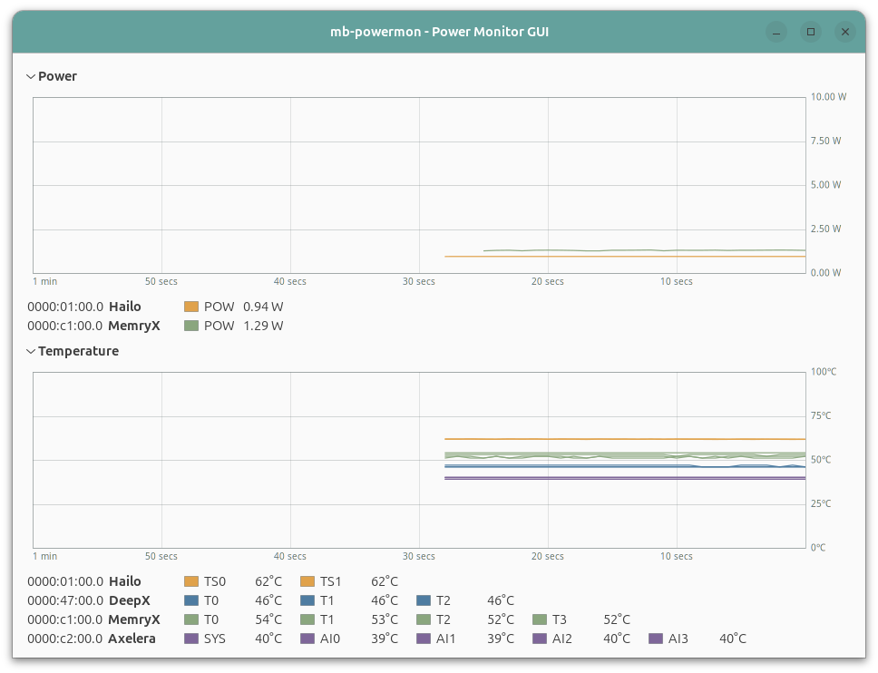

# mb-powermon-gui

A C++ / GTK4 (gtkmm) desktop GUI that monitors the **power and temperature** of
edge-AI NPUs, styled after Ubuntu's **System Monitor** (the *Resources* tab). It
is the GUI counterpart to the terminal-based [`mb-powermon`](../mb-powermon)
Python tool — same telemetry, rendered as scrolling time-series graphs in a
native desktop window.



## What it shows

Two sections, each a scrolling 60-second graph with a per-device legend of live
values:

- **Power** (W) — one trace per power reading, 10 W default axis (auto-expands).
- **Temperature** (°C) — one trace per on-die sensor, fixed 0–100 °C axis.

Every metric from a given card shares that card's color, kept consistent across
both graphs, and the legend groups metrics **one device per row** (prefixed with
the PCIe BDF), e.g. `0000:c2:00.0 Axelera  SYS · AI0 · AI1 · AI2 · AI3`.

## Supported devices & how telemetry is read

| Device | Temperature | Power | Passive? |
| ------ | ----------- | ----- | -------- |
| **Hailo-8** | `TS0` / `TS1` via HailoRT C++ API (`get_chip_temperature`) | `POW` — firmware-averaged, via `set/start/get_power_measurement` | temp ✅ · **power no** |
| **DeepX M1** | `T0`–`T2` via `dxrt-cli -s` (reads the kernel driver) | — (not exposed) | ✅ |
| **MemryX MX3** | `T0`–`T3` via sysfs/hwmon | `POW` via the MemryX SDK over the `mxa-manager` daemon | ✅ (daemon-shared) |
| **Axelera Metis** | `SYS` / `AI0`–`AI3` via `triton_trace --peek` | — (not exposed on M.2) | ✅ |

Devices are auto-discovered at startup; only what's present appears. Whatever a
card doesn't expose simply doesn't get a trace.

### A note on "passive"

Everything is passive (never claims a device or perturbs another app's use of
it) **except Hailo power**: measuring it takes over the firmware's shared
averaging buffer and **disables Hailo's overcurrent protection while active**, so
it can interfere with — or be clobbered by — another HailoRT power client (e.g.
running the Python `mb-powermon` at the same time). Temperature reads are always
passive. Hailo power auto-recovers the buffer after repeated misses.

MemryX power has no C++ telemetry library, so it's read by a small persistent
Python helper launched from the MemryX venv, which connects once to the
multi-process `mxa-manager` daemon and streams the reading — no per-poll cost and
no interference with inference.

## Build & run

Requires `gtkmm-4.0`, the HailoRT runtime (`libhailort` + `/usr/local/include/hailo`),
CMake ≥ 3.16, and a C++17 compiler.

```bash
sudo apt install libgtkmm-4.0-dev cmake g++     # + the HailoRT runtime package

cmake -S . -B build -DCMAKE_BUILD_TYPE=Release
cmake --build build -j
./build/mb-powermon
```

Quit by closing the window (or `Ctrl+C` in the terminal). Over SSH, prefix with
`DISPLAY=:0`.

### Configuration

- **MemryX power** uses a Python interpreter that can `import memryx`. It looks
  for `$HOME/mb-edgeai/memryx-env` by default; override with
  `MB_MEMRYX_PYTHON=/path/to/venv/bin/python3`. If none is found, MemryX simply
  shows no power row.
- The `[HailoRT] … overcurrent protection` lines printed at startup are the
  expected OCP-disable notice for the Hailo power session, not errors.

## Design

- **Sampling** runs once per second; each graph keeps a 60-second (61-point)
  history and draws newest-on-the-right.
- **Colors** come only from the project brand palette: device series use the
  **accent** colors (Amber → Hailo, Slate Blue → DeepX, Sage → MemryX, Plum →
  Axelera; Coral reserved for alerts, Sand for fills), graph chrome uses the
  **neutrals** (Slate Gray grid/text, near-white plot), and the title bar is the
  brand Teal.
- Missing readings render as gaps in the trace and `—` in the legend.

## Layout of the code

| File | Role |
| ---- | ---- |
| `src/Probes.{h,cpp}` | device discovery + per-tick telemetry (HailoRT / `dxrt-cli` / sysfs / `triton_trace` / MemryX helper). No GTK dependency. |
| `src/GraphArea.{h,cpp}` | reusable Cairo scrolling multi-series graph (fixed or auto axis, NaN gaps, height-responsive) |
| `src/MainWindow.{h,cpp}` | the two sections, device-grouped legend, teal header bar, 1 Hz refresh |
| `src/util.h` | brand palette (accent + neutral), size/rate formatting, nice-axis rounding |
| `src/main.cpp` | `Gtk::Application` entry point |

## License

Apache License 2.0 (matching the parent `mb-powermon` project).
