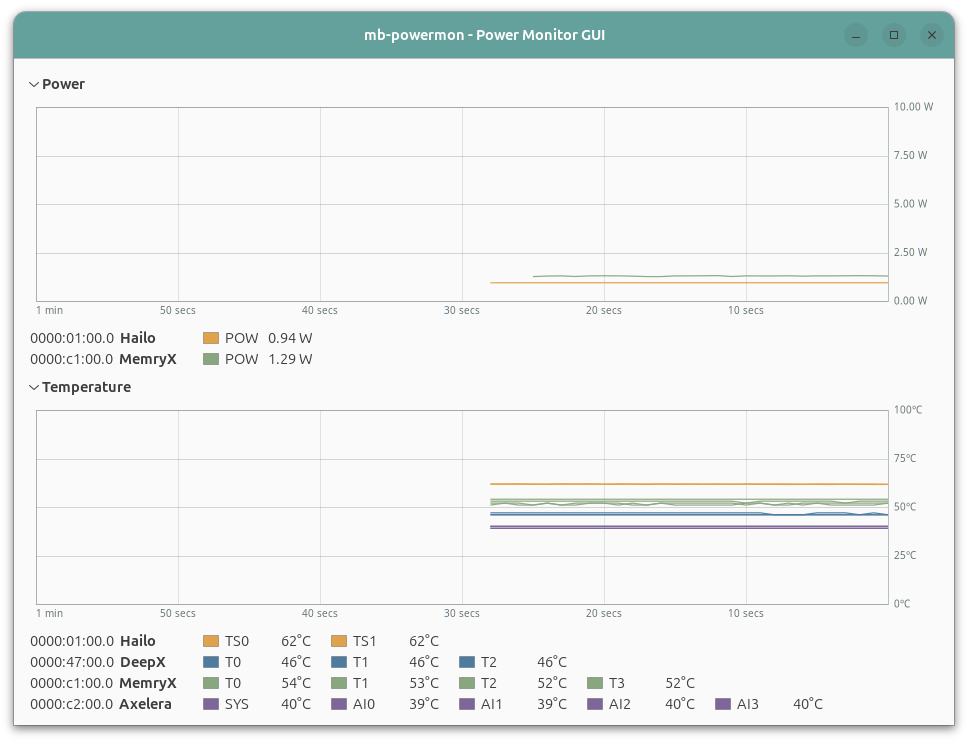

# mb-powermon-gui

A C++ / GTK4 (gtkmm) desktop GUI that monitors the **power and temperature** of
edge-AI NPUs, styled after Ubuntu's **System Monitor** (the *Resources* tab). It
is the GUI counterpart to the terminal-based [`mb-powermon`](../mb-powermon)
Python tool — same telemetry, rendered as scrolling time-series graphs in a
native desktop window.



## What it shows

Two sections, each a scrolling 60-second graph with a per-device legend of live
values:

- **Power** (W) — one trace per power reading, 10 W default axis (auto-expands).
- **Temperature** (°C) — one trace per on-die sensor, fixed 0–100 °C axis.

Every metric from a given card shares that card's color, kept consistent across
both graphs, and the legend groups metrics **one device per row** (prefixed with
the PCIe BDF), e.g. `0000:c2:00.0 Axelera  SYS · AI0 · AI1 · AI2 · AI3`.

Each device row also carries a **per-device summary** between the name and the
individual readings: temperature shows the device's **average** across its
sensors (`avg 60°C`), power shows the **max** across its readings (`max 0.93 W`).
With one power source per card today the max equals that lone reading, but it's
computed over all of a device's power metrics — so when an external INA228 meter
is added alongside the on-card source, the label reports the highest of them.

## Supported devices & how telemetry is read

| Device | Temperature | Power | Passive? |
| ------ | ----------- | ----- | -------- |
| **Hailo-8** | `TS0` / `TS1` via HailoRT C++ API (`get_chip_temperature`) | `POW` — firmware-averaged, via `set/start/get_power_measurement` | temp ✅ · **power no** |
| **DeepX M1** | `T0`–`T2` via `dxrt-cli -s` (reads the kernel driver) | — (not exposed) | ✅ |
| **MemryX MX3** | `T0`–`T3` via sysfs/hwmon | `POW` via the MemryX SDK over the `mxa-manager` daemon | ✅ (daemon-shared) |
| **Axelera Metis** | `SYS` / `AI0`–`AI3` via `triton_trace --peek` | — (not exposed on M.2) | ✅ |
| **Qualcomm IQ** (IQ-9075 / QCS9075) | `N0-0`–`N1-2` via the `nsp-*-thermal` sysfs zones | — (**no** power measurement exists on the board) | ✅ |
| **IQ9075 Board** (ambient) | `AMB` via a TI TMP411 on i2c-19 0x4c (hwmon `temp1_input`) | — | ✅ |
| **INA228** (external) | — | `POW` (W) — an INA228 on an FT232H USB→I²C bridge (libftdi1 MPSSE), one probe per bridge | ✅ (measures the rail, never touches the NPU) |

Devices are auto-discovered at startup; only what's present appears. Whatever a
card doesn't expose simply doesn't get a trace. One exception: a Metis whose
`/dev/metis-0:*` node exists but isn't currently reporting temps (see the Axelera
note under [Configuration](#configuration)) still gets a legend row — values `—`
until data flows — with the reason logged, rather than silently vanishing.

### Enabling the IQ-9075 board ambient sensor

The EVK carries a **TI TMP411** at `i2c-19 0x4c` (sharing that bus with the
`amc6821` fan controller) that no IQ-9075 device tree declares, so nothing binds
it and it exposes no hwmon by default. Instantiate it once and the `IQ9075 Board`
row appears; skip this and the probe simply contributes no row.

```bash
sudo modprobe tmp401
echo "tmp411 0x4c" | sudo tee /sys/bus/i2c/devices/i2c-19/new_device
```

That lasts until reboot. To make it persistent:

```bash
sudo tee /etc/systemd/system/tmp411-board-sensor.service >/dev/null <<'EOF'
[Unit]
Description=Instantiate the IQ-9075 board ambient sensor (TMP411, i2c-19 0x4c)
After=sysinit.target

[Service]
Type=oneshot
RemainAfterExit=yes
ExecStart=/sbin/modprobe tmp401
ExecStart=/bin/sh -c 'echo "tmp411 0x4c" > /sys/bus/i2c/devices/i2c-19/new_device'
ExecStop=/bin/sh -c 'echo 0x4c > /sys/bus/i2c/devices/i2c-19/delete_device'

[Install]
WantedBy=multi-user.target
EOF
sudo systemctl enable --now tmp411-board-sensor.service
```

Undo at any time with
`echo 0x4c | sudo tee /sys/bus/i2c/devices/i2c-19/delete_device`.

This is **board** temperature, not NPU die temperature, so it gets its own legend
row and its own `avg` — folding it into the NPU row would drag that average
toward ambient. The chip also has a valid remote-diode channel (`temp2`, ~65 °C,
`temp2_fault=0`), but what that diode is wired to can't be determined without the
board schematic, so it is deliberately not exposed rather than labelled with a
guess.

### Why the Qualcomm IQ has no power row

Unlike the M.2 cards, the IQ-9075's NPU is the SoC's own Hexagon **NSP**, and the
board has no power measurement at all — not merely "not wired up":

- **No power-monitor IC on any IQ-9075 variant.** Scanning all 331 DTBs shipped
  with this kernel for INA/shunt compatibles, the only hits are `monaco`/`monza`
  (`ti,ina232` + `shunt-resistor`) — a different Qualcomm platform. None of the
  five IQ-9075 DTBs, mezzanine variants included, declare one. (Control: the
  `amc6821` fan controller *is* found in those DTBs, so the scan is sound.)
- **No undeclared one either.** Scanning i2c buses 18/19/20 turned up four
  devices missing from every IQ-9075 DTB, but none is a power monitor: `19-0x4c`
  is a TI **TMP411** board-ambient sensor (paired with the fan controller for fan
  control, not an NPU sensor), `20-0x47` is unidentified but answers none of the
  INA ID registers, and `19-0x51` / `20-0x21` fall outside the INA address range.
- **No hwmon power/current sensor** — the only real hwmon device under
  `/sys/devices` is that fan controller.
- **No power readback in the vendor runtime** — across 44 QNN libraries plus
  `libSNPE.so`, the only power symbols set or get the DCVS *mode*
  (burst / balanced / power_saver). That's a knob, not a meter.
- No `powercap`/RAPL, no `current_now` on the `power_supply` nodes, and the PMIC
  VADC offers die temperatures and `vph_pwr` *voltage* but no current.

The NSP also shares the package rail with the CPU and GPU, so even a
package-level figure would not be an NPU figure. The probe therefore reports
temperature only, rather than publishing an estimate that would sit next to
genuine measurements from the other cards.

**Adding real watts here**, if you want them, is easier than the external-meter
route: wire an INA23x/INA228 onto an i2c bus and declare it in a device-tree
overlay the way `monaco` does. This kernel already ships `ina2xx` / `ina238` /
`ina209`, so it shows up as an ordinary hwmon `power1_input` that a probe reads
in a few lines — no USB bridge and no Python helper.

The kernel exposes 12 NSP zones — 2 NSP instances × 3 blocks × 2 redundant TSENS
taps per block. The probe collapses each block's two taps to their **max**, so
the legend shows 6 entries (`N<instance>-<block>`) instead of 12.

### A note on "passive"

Everything is passive (never claims a device or perturbs another app's use of
it) **except Hailo power**: measuring it takes over the firmware's shared
averaging buffer and **disables Hailo's overcurrent protection while active**, so
it can interfere with — or be clobbered by — another HailoRT power client (e.g.
running the Python `mb-powermon` at the same time). Temperature reads are always
passive. Hailo power auto-recovers the buffer after repeated misses.

MemryX power has no C++ telemetry library, so it's read by a small persistent
Python helper launched from the MemryX venv, which connects once to the
multi-process `mxa-manager` daemon and streams the reading — no per-poll cost and
no interference with inference.

The external **INA228** meter is fully passive too: it reads a sensor sitting on
the power rail through its own FT232H USB→I²C bridge, so it never touches the
accelerator at all. It's the only reference-grade watt figure for cards that
expose no on-die power (Axelera M.2, Qualcomm IQ).

## Build & run

Requires `gtkmm-4.0`, CMake ≥ 3.16, and a C++17 compiler. Two backends are
**optional**, each compiled out (with a CMake status line) when absent:
- **HailoRT runtime** (`libhailort` + `/usr/local/include/hailo`) — enables Hailo-8;
  its absence is how the build works on hosts with no Hailo-8 (e.g. the IQ-9075 EVK).
- **`libftdi1`** (the 1.x dev package) — enables the INA228/FT232H external power probe.

```bash
sudo apt install libgtkmm-4.0-dev libftdi1-dev cmake g++   # libftdi1-dev optional
                                                # (INA228); + HailoRT pkg for Hailo-8

cmake -S . -B build -DCMAKE_BUILD_TYPE=Release
cmake --build build -j
./build/mb-powermon
```

Quit by closing the window (or `Ctrl+C` in the terminal). Over SSH, prefix with
`DISPLAY=:0`.

### Configuration

- **MemryX power** uses a Python interpreter that can `import memryx`. It looks
  for `$HOME/mb-edgeai/memryx-env` by default; override with
  `MB_MEMRYX_PYTHON=/path/to/venv/bin/python3`. If none is found, MemryX simply
  shows no power row.
- The `[HailoRT] … overcurrent protection` lines printed at startup are the
  expected OCP-disable notice for the Hailo power session, not errors.
- **Axelera temperatures** need two things the probe deliberately won't force (it
  stays passive): the card's **application firmware loaded**, and the collector
  **log level at `inf`**. A running Voyager inference app clears both automatically —
  and both reset on reboot. Idle after a fresh boot, the Metis sits in *bootloader*
  firmware, so the legend still shows an Axelera row (values `—`) and the startup log
  says why (`… version mismatch, temps unavailable …`). To bring temps back without
  running a model: load firmware into RAM with `axcmd --device <dev> --fwload
  /opt/axelera/device-*/omega/bin/start_axelera_runtime.elf` (not `--flashload`), then
  `triton_trace --device <dev> --slog-level inf`. The row fills in on its own within a
  second — no restart needed.
- **INA228 external power** is auto-discovered: every FT232H bridge (`0403:6014`) is
  enumerated and its INA228 (canonical addresses `{0x40,0x41,0x44,0x45}`) read over
  libftdi1 MPSSE-I²C. Two prerequisites:
  - **`libftdi1-dev`** at build time (`pkg-config libftdi1`, the **1.x** package —
    header `<libftdi1/ftdi.h>`, not legacy 0.x). Absent → the probe is compiled out.
  - **USB permissions**: the FT232H raw node must be openable by your user. Install a
    udev rule (`SUBSYSTEM=="usb", ATTRS{idVendor}=="0403", MODE="0666"`) — udev applies
    it on the next `add` event, so a fresh boot or a replug picks it up. libftdi
    auto-detaches the `ftdi_sio` serial driver, so `/dev/ttyUSB*` being present is fine.

  Bridges here carry no USB serial, so probes are named by enumeration order
  (`INA228#0`, `INA228#1`) with the USB bus/address as the BDF (`usb 1-3`). That order
  isn't a stable accelerator mapping across replug/reboot — a config file mapping each
  bridge to an accelerator is planned.

## Design

- **Sampling** runs once per second; each graph keeps a 60-second (61-point)
  history and draws newest-on-the-right. The per-device summary (avg temp / max
  power) is recomputed each tick, skipping any `NaN` readings.
- **Colors** come only from the project brand palette: device series take the
  **accent** colors in discovery order (Amber, Slate Blue, Sage, Plum, then Sand;
  Coral is reserved for alerts), so on a host with all backends present that runs
  Hailo → DeepX → MemryX → Axelera → Qualcomm IQ, and on a host with only one
  device that device is Amber. Graph chrome uses the **neutrals** (Slate Gray
  grid/text, near-white plot), and the title bar is the brand Teal.
- Missing readings render as gaps in the trace and `—` in the legend.

## Layout of the code

| File | Role |
| ---- | ---- |
| `src/Probes.{h,cpp}` | device discovery + per-tick telemetry (HailoRT / `dxrt-cli` / sysfs / `triton_trace` / MemryX helper / `nsp-*-thermal` zones / INA228 over FT232H via libftdi1). No GTK dependency. |
| `src/GraphArea.{h,cpp}` | reusable Cairo scrolling multi-series graph (fixed or auto axis, NaN gaps, height-responsive) |
| `src/MainWindow.{h,cpp}` | the two sections, device-grouped legend, teal header bar, 1 Hz refresh |
| `src/util.h` | brand palette (accent + neutral), size/rate formatting, nice-axis rounding |
| `src/main.cpp` | `Gtk::Application` entry point |

## License

Apache License 2.0 (matching the parent `mb-powermon` project).
